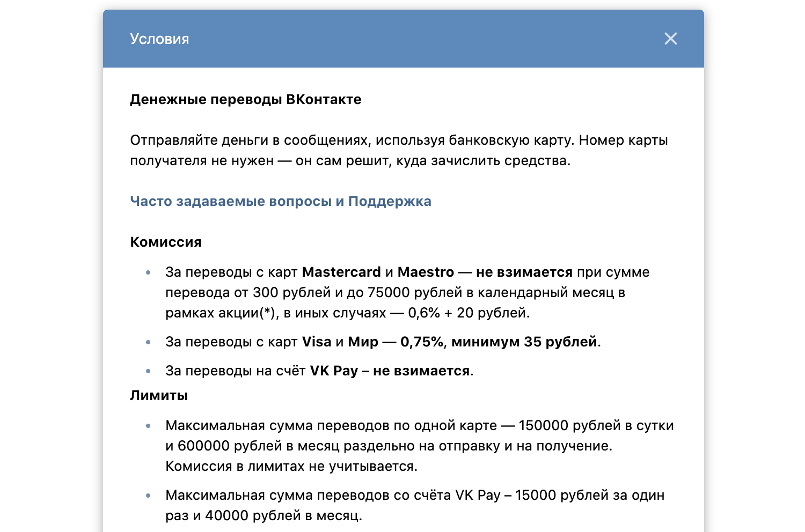

# Домашнее задание к занятию «1.3. Управляющие конструкции. Функции»

## Задача №2. Разная комиссия

В прошлый раз мы рассматривали упрощённый вариант вычисления комиссии. Давайте усложним задачу. 

За MasterCard и Maestro вообще не нужно платить, пока не превысили лимит (замечание `от 300` убираем), а для VK Pay всегда бесплатно:

Напишите алгоритм расчёта в виде функции, передавая в функцию:
* тип карты/счёта (по умолчанию VK Pay);
* сумму предыдущих переводов в этом месяце (по умолчанию 0 рублей);
* сумму совершаемого перевода.

Итог: у вас должен быть репозиторий на GitHub, в котором будет ваш Gradle-проект.